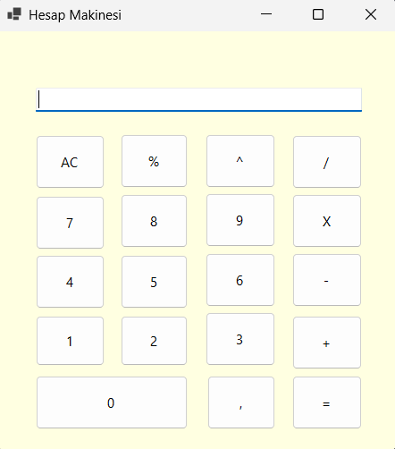

# 🧮 C# Windows Forms Hesap Makinesi

C# programlama dili ve Windows Forms arayüzü kullanılarak geliştirilmiş, temel matematiksel işlemlerin yanı sıra üs alma ve mod alma işlemlerini de yapabilen modern tasarımlı bir hesap makinesi uygulaması.

## 🚀 Özellikler
- **Temel İşlemler:** Toplama (+), Çıkarma (-), Çarpma (X), Bölme (/)
- **Gelişmiş İşlemler:** 
  - Üs Alma (`^`) (Örn: 2^3 = 8)
  - Mod Alma (`%`) (Örn: 10%3 = 1)
- Temiz ve sade kullanıcı arayüzü.

## 📷 Ekran Görüntüsü

## 🛠️ Kullanılan Teknolojiler
- **Dil:** C# (C-Sharp)
- **Framework:** .NET 10.0 / Windows Forms
- **Geliştirme Ortamı:** Visual Studio
